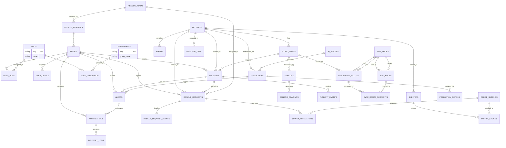

# AEGISFLOW AI — Business Logic

> **Phiên bản:** 1.0.0
> **Ngày:** 2026-04-10
> **Múi giờ:** Asia/Ho_Chi_Minh (UTC+7)
> **Ngôn ngữ nghiệp vụ:** Tiếng Việt

---

## Mục lục

1. [Tổng quan](#1-tổng-quan)
2. [Quản lý người dùng & Xác thực](#2-quản-lý-người-dùng--xác-thực)
3. [Quản lý Lũ lụt](#3-quản-lý-lũ-lụt)
4. [Quản lý Sự cố (Incidents)](#4-quản-lý-sự-cố-incidents)
5. [Quản lý Cứu hộ](#5-quản-lý-cứu-hộ)
6. [Định tuyến & Sơ tán](#6-định-tuyến--sơ-tán)
7. [AI/ML Dự đoán](#7-aiml-dự-đoán)
8. [Cảnh báo & Thông báo](#8-cảnh-báo--thông-báo)
9. [Luồng nghiệp vụ chính](#9-luồng-nghiệp-vụ-chính)
10. [Quy tắc tính điểm ưu tiên](#10-quy-tắc-tính-điểm-ưu-tiên)
11. [Cấu hình & Ngưỡng](#11-cấu-hình--ngưỡng)

---

## 1. Tổng quan

### 1.1 Các vai trò chính

| Vai trò | Mô tả | Người dùng mặc định |
|---------|-------|----------------------|
| **city_admin** | Toàn quyền quản lý hệ thống | Quản trị viên CNTT |
| **rescue_operator** | Điều phối cứu hộ, giám sát | Trung tâm điều hành |
| **rescue_team** | Thực địa: cứu hộ, vận chuyển | Nhân viên cứu hộ |
| **citizen** | Gửi yêu cầu cứu hộ, nhận cảnh báo | Người dân |
| **ai_operator** | Vận hành hệ thống AI | Chuyên gia AI |

### 1.2 Các loại entity chính

```
User ─────┬── Role ── Permission
          │
FloodZone ──┬── Sensor ──── SensorReading
            │
Incident ───┬── IncidentEvent
           │
RescueRequest ───┬── RescueTeam
                ├── Shelter
                ├── SupplyAllocation
                └── ReliefSupply
           │
EvacuationRoute ───┬── MapNode
                  ├── MapEdge
                  └── RouteSegment
           │
Prediction ───────┬── AIModel
                  └── PredictionDetail
           │
Alert ─────── Notification ─── NotificationDeliveryLog
```

---

## 2. Quản lý người dùng & Xác thực

### 2.1 Đăng ký & Đăng nhập

```
[1] Đăng ký
    - Email + Password + Name + Phone
    - Mặc định gán vai trò: citizen
    - Gửi email xác thực (email_verified_at)

[2] Đăng nhập
    - Email + Password → JWT Token
    - Lưu last_login_at, last_login_ip
    - Token hết hạn sau 7 ngày (refresh token 30 ngày)

[3] Đăng nhập đội cứu hộ
    - Được admin gán tài khoản
    - Có thêm thông tin: team_id, badge_number
```

### 2.2 Phân quyền (RBAC)

```
Người dùng ← user_role → Role ← role_permission → Permission

Quy tắc:
- 1 User có thể có nhiều Role
- 1 Role có nhiều Permission
- Kiểm tra: $user->hasPermissionTo('rescue.requests.manage')
```

### 2.3 Thiết bị FCM

```
[1] Đăng ký thiết bị
    - user_id + device_token + device_type (ios|android|web)
    - 1 user có nhiều device_token

[2] Gửi notification
    - Tìm tất cả device của user
    - Gửi FCM → mỗi device → lưu delivery log
```

---

## 3. Quản lý Lũ lụt

### 3.1 Vùng ngập (FloodZone)

```python
# Logic cập nhật trạng thái vùng ngập
KHI có sensor_reading mới:
    IF water_level >= danger_threshold:
        status = 'flooded'       # Ngập nghiêm trọng
        risk_level = 'critical'
    ELSE IF water_level >= alert_threshold:
        status = 'danger'          # Nguy hiểm
        risk_level = 'high'
    ELSE IF water_level >= alert_threshold * 0.7:
        status = 'alert'           # Cảnh báo
        risk_level = 'medium'
    ELSE:
        status = 'monitoring'      # Theo dõi
        risk_level = 'low'

    # Cập nhật mực nước
    current_water_level_m = MAX(current, new_value)
```

### 3.2 Ngưỡng cảnh báo mặc định

| Ngưỡng | Giá trị | Màu hiển thị | Trạng thái |
|--------|---------|---------------|-------------|
| An toàn | < 0.5m | `#17b26a` | monitoring |
| Cảnh báo | ≥ 1.5m | `#f79009` | alert |
| Nguy hiểm | ≥ 3.0m | `#f04438` | danger |
| Ngập | ≥ 5.0m | `#920000` | flooded |

### 3.3 Cảm biến (Sensor)

```python
# Trạng thái cảm biến
KHI đọc dữ liệu mới:
    last_value = new_value
    last_reading_at = now()
    status = 'online'

    # Kiểm tra bất thường
    IF new_value >= danger_threshold OR
       new_value < min_value OR
       new_value > max_value OR
       quality_score < 0.5:
        is_anomaly = true

KHI không có reading trong 10 phút:
    status = 'offline'

KHI báo cáo lỗi từ thiết bị:
    status = 'error'
```

### 3.4 Dữ liệu cảm biến

```python
# Chu kỳ đọc: mặc định 5 phút (300 giây)
# Lưu trữ: partitioned theo tháng
# Xóa log: sau 12 tháng (có thể điều chỉnh)

# Trigger tự động:
- check_flood_threshold(): kiểm tra ngưỡng → tạo incident nếu cần
- update_sensor_last_reading(): cập nhật last_value của sensor
```

---

## 4. Quản lý Sự cố (Incidents)

### 4.1 Vòng đời sự cố

```
                                    ┌──────────┐
                                    │ reported │
                                    └─────┬────┘
                                          │
                              ┌───────────┼───────────┐
                              ▼           ▼           ▼
                         ┌────────┐  ┌──────────┐  ┌──────────┐
                         │verified│  │  auto    │  │  closed  │
                         │  by    │  │  merged  │  │(duplicate│
                         │operator│  │(same loc)│  │  /spam) │
                         └────┬───┘  └──────────┘  └──────────┘
                              │
              ┌───────────────┼───────────────┐
              ▼               ▼               ▼
         ┌──────────┐    ┌──────────┐    ┌──────────┐
         │responded │    │resolved  │    │ closed   │
         │ by AI    │    │ by team  │    │timeout   │
         │+operator │    │          │    │+admin    │
         └────┬─────┘    └────┬─────┘    └──────────┘
              │               │
              └───────┬───────┘
                      ▼
                 ┌──────────┐
                 │ closed   │
                 └──────────┘
```

### 4.2 Các loại sự cố

| type | Mô tả | Nguồn thường gặp |
|------|-------|-------------------|
| `flood` | Ngập đường/phố | citizen, camera, sensor |
| `heavy_rain` | Mưa lớn kéo dài | weather_api |
| `landslide` | Sạt lở đất | citizen, camera |
| `dam_failure` | Vỡ đập/thủy điện | sensor, operator |
| `other` | Khác | citizen |

### 4.3 Tạo sự cố

```python
# Từ báo cáo công dân
KHI citizen gửi báo cáo:
    Tạo incident với:
        - source = 'citizen'
        - status = 'reported'
        - severity = tự động tính từ mô tả + vùng ngập

# Từ camera AI
KHI AI phát hiện ngập qua camera:
    Tạo incident với:
        - source = 'camera'
        - auto-assign severity từ mô hình

# Từ ngưỡng cảm biến (trigger)
KHI water_level >= danger_threshold:
    Tạo incident:
        - source = 'sensor'
        - type = 'flood'
        - severity = 'critical' | 'high' (tùy ngưỡng)
```

### 4.4 Timeline sự cố

```python
# Mỗi hành động trên incident → tạo 1 event
incident_events.event_type:
    - 'created'        # Tạo mới
    - 'assigned'       # Gán cho người xử lý
    - 'status_changed' # Đổi trạng thái
    - 'severity_updated' # Đổi mức độ
    - 'location_updated' # Cập nhật vị trí
    - 'photo_added'    # Thêm ảnh
    - 'comment'        # Bình luận
    - 'merged'         # Gộp sự cố
    - 'resolved'       # Đã xử lý
```

---

## 5. Quản lý Cứu hộ

### 5.1 Yêu cầu cứu hộ (RescueRequest)

#### Vòng đời

```
pending → assigned → in_progress → completed
    ↓         ↓           ↓
 cancelled  cancelled  cancelled (hủy)
```

#### Tính điểm ưu tiên (AI)

```python
# priority_score = tổng hợp các yếu tố
base_score = 50

# 1. Mức độ khẩn (30 điểm)
IF urgency == 'critical': score += 30
ELIF urgency == 'high':    score += 20
ELIF urgency == 'medium':  score += 10
ELSE:                      score += 0

# 2. Nhóm yếu thế (25 điểm)
IF 'children' IN vulnerable_groups:     score += 10
IF 'elderly' IN vulnerable_groups:     score += 8
IF 'disabled' IN vulnerable_groups:     score += 5
IF 'pregnant' IN vulnerable_groups:     score += 7

# 3. Số người cần cứu (15 điểm)
IF people_count >= 10:  score += 15
ELIF people_count >= 5: score += 10
ELIF people_count >= 2: score += 5
ELSE:                  score += 0

# 4. Mực nước tại vị trí (15 điểm)
IF water_level_m >= 3.0: score += 15
ELIF water_level_m >= 1.5: score += 10
ELIF water_level_m >= 0.5: score += 5

# 5. Thời gian chờ (10 điểm)
waiting_minutes = NOW() - created_at
IF waiting_minutes >= 120: score += 10
ELIF waiting_minutes >= 60: score += 7
ELIF waiting_minutes >= 30: score += 4
ELIF waiting_minutes >= 15: score += 2

# 6. Kết hợp sự cố (5 điểm)
IF incident_id IS NOT NULL AND incident.severity == 'critical': score += 5

# Normalize về 0-100
priority_score = MIN(100, score)
```

#### Phân công đội cứu hộ

```python
KHI operator phân công rescue_team:
    1. Kiểm tra đội có status = 'available'
    2. Kiểm tra personnel_count > 0
    3. Tính khoảng cách từ current_location → request.geometry
    4. Ưu tiên đội:
       - Cùng district
       - Khoảng cách < 10km
       - Có specialization phù hợp với category
       - Đang available

    UPDATE rescue_requests SET:
        assigned_team_id = team.id
        assigned_at = NOW()
        status = 'assigned'
        eta_minutes = distance_km / 40 * 60  # ~40km/h trong thành phố

    UPDATE rescue_teams SET:
        status = 'dispatched'
        heading_to_incident_id = request.id
```

### 5.2 Đội cứu hộ (RescueTeam)

```python
# Trạng thái đội
available:  Sẵn sàng tiếp nhận nhiệm vụ mới
dispatched: Đang di chuyển đến hiện trường
busy:      Đang làm nhiệm vụ tại hiện trường
offline:   Không hoạt động

# Cập nhật vị trí (từ app thực địa)
KHI rescue_team cập nhật vị trí:
    - current_latitude, current_longitude = GPS
    - current_location = ST_Point(long, lat, 4326)
    - last_location_update = NOW()

    # Tự động gán node gần nhất
    current_node_id = (
        SELECT id FROM map_nodes
        ORDER BY ST_Distance(current_location, geometry)
        LIMIT 1
    )
```

### 5.3 Điểm trú ẩn (Shelter)

```python
# Trạng thái
open:      Mở cửa, tiếp nhận
full:      Đã đầy (>90% capacity)
closed:    Đóng cửa
preparing: Đang chuẩn bị

# Cập nhật sức chứa
KHI người vào shelter:
    current_occupancy += 1
    IF current_occupancy >= capacity * 0.9:
        status = 'full'

KHI người rời shelter:
    current_occupancy -= 1
    IF current_occupancy < capacity * 0.9:
        status = 'open'
```

### 5.4 Vật tư cứu hộ

```python
# Phân bổ vật tư
KHI phân bổ vật tư cho request:
    1. Tìm kho gần nhất có đủ số lượng
    2. Kiểm tra reserved_quantity
    3. Tạo supply_allocation:
       - from_stock_id = stock.id
       - to_shelter_id = request.shelter_id
       - quantity = requested
       - status = 'pending'

    4. Cập nhật reserved_quantity:
       supply_stocks SET reserved_quantity += quantity

KHI vật tư được giao:
    UPDATE supply_allocations SET:
        status = 'delivered'
        delivered_at = NOW()

    UPDATE supply_stocks SET:
        quantity -= allocated_quantity
        reserved_quantity -= allocated_quantity

KHI hủy phân bổ:
    supply_stocks SET reserved_quantity -= reserved
```

---

## 6. Định tuyến & Sơ tán

### 6.1 Đồ thị bản đồ

```python
# Cấu trúc đồ thị cho routing
nodes:  Các điểm giao nhau, cầu, điểm trú ẩn
edges: Đoạn đường nối 2 nodes

# Metrics thời gian thực
KHI có dữ liệu từ cảm biến giao thông:
    UPDATE map_edges SET:
        current_density = calculated
        current_speed_kmh = measured
        congestion_level = classify(density, speed)

    # Phân loại tắc đường
    IF density > 0.8 AND speed < 10:    congestion = 'gridlock'
    ELIF density > 0.6 AND speed < 20:  congestion = 'heavy'
    ELIF density > 0.4 AND speed < 30:   congestion = 'moderate'
    ELIF density > 0.2:                 congestion = 'light'
    ELSE:                               congestion = 'none'
```

### 6.2 Tuyến sơ tán

```python
# Tính toán tuyến sơ tán
KHI tính tuyến cho vùng ngập:
    1. Tìm start_node (gần tâm vùng ngập nhất)
    2. Tìm end_node (shelter an toàn gần nhất)
    3. Chạy A* / Dijkstra trên graph:
       - Bỏ qua edges có status = 'blocked' | 'flooded'
       - Bỏ qua edges có is_flood_prone = true khi water_level cao
       - Trọng số = length / (max_speed * safety_factor)

    4. Lưu kết quả:
       - geometry (PostGIS LineString)
       - polyline (Google/Leaflet format)
       - distance_m, estimated_time_seconds
       - is_safe, safety_rating

    5. Gán segments cho tuyến

# An toàn tuyến
safety_rating = 1 - SUM(segment_risks) / COUNT(segments)
segment_risk = 1 IF edge.is_flood_prone ELSE 0.2
```

### 6.3 Cập nhật trạng thái tuyến

```python
KHI vùng ngập thay đổi:
    FOR EACH evacuation_route có flood_zone_id:
        FOR EACH segment IN route:
            IF segment.edge.flood_zone_id == changed_zone:
                IF new_water_level >= threshold:
                    segment.is_flood_prone = true
                    segment.risk_level = 'high'
                    route.status = 'blocked'
                    UPDATE route SET status = 'blocked'

KHI water_level giảm xuống:
    IF water_level < safe_threshold:
        route.status = 'active'
        segment.is_flood_prone = false
```

---

## 7. AI/ML Dự đoán

### 7.1 Chu kỳ dự báo

```python
# Dự báo định kỳ: mỗi 15 phút
Mỗi 15 phút:
    1. Lấy dữ liệu sensor_readings (24 giờ gần nhất)
    2. Lấy dữ liệu weather_data
    3. Chạy AI model
    4. Lưu prediction
    5. Sinh alert nếu probability > threshold
```

### 7.2 Các mô hình

| Mô hình | Loại | Input | Output | Horizon |
|---------|------|-------|--------|---------|
| Water Level LSTM | LSTM | 24h readings + weather | water_level (m) | 15-120 phút |
| Rainfall CNN | CNN | Radar image | rainfall_class | 1-6 giờ |
| Flood Risk Ensemble | Ensemble | multi-source | flood_probability | 15-1440 phút |
| Alert Rule Engine | Rule | thresholds | alert | Tức thời |

### 7.3 Xác nhận dự báo

```python
# Dự báo từ AI → Operator xác nhận
KHI prediction mới được tạo:
    status = 'generated'

KHI operator xác nhận:
    status = 'verified'
    verified_by = user.id
    verified_at = NOW()

KHI AI gửi cảnh báo tự động:
    status = 'alerted'
    → Sinh Alert
    → Sinh Notification cho affected users

KHI prediction hết hạn (quá 2x horizon):
    status = 'expired'
```

### 7.4 Chi tiết dự báo theo vùng

```python
KHI lưu prediction:
    FOR EACH affected entity (district/zone/sensor):
        prediction_detail = {
            entity_type: 'district' | 'flood_zone' | 'ward',
            entity_id: id,
            predicted_value: model_output,
            confidence: model.confidence,
            probability: calculated_probability,
            severity: classify(probability),
            risk_factors: [list of contributing factors]
        }
```

---

## 8. Cảnh báo & Thông báo

### 8.1 Vòng đời cảnh báo

```
draft → active → updated → resolved → expired
                    ↓
                (phát cảnh báo mới thay thế)
```

### 8.2 Sinh cảnh báo tự động

```python
# Từ AI prediction
KHI prediction mới với probability >= 0.6:
    Tạo alert:
        title = "Cảnh báo ngập {zone_name}"
        alert_type = 'flood_warning'
        severity = prediction.severity
        geometry = prediction.target_area
        related_prediction_id = prediction.id

# Từ sensor threshold
KHI sensor_reading.water_level >= alert_threshold:
    Kiểm tra đã có alert đang active cho vùng này chưa
    NẾU CHƯA: Tạo alert mới
    NẾU CÓ: Cập nhật severity nếu cần

# Từ incident
KHI incident.severity = 'critical' OR 'high':
    Tạo alert:
        alert_type = 'flood_warning'
        related_incident_id = incident.id
```

### 8.3 Gửi thông báo

```python
KHI tạo alert mới:
    1. Xác định phạm vi gửi:
       - target_type = 'all' → toàn bộ user
       - target_type = 'district' → user trong affected_districts
       - target_type = 'role' → user có vai trò cụ thể

    2. Tạo notification:
       - alert_id = alert.id
       - title = alert.title
       - body = alert.description
       - data = {alert_id, severity, geometry}

    3. Gửi theo channel:
       - FCM → user_devices (ios/android/web)
       - Email → user.email (nếu bật)
       - SMS → user.phone (khẩn cấp)

    4. Cập nhật delivery stats:
       - total_sent++
       - total_delivered++ khi FCM success
       - failed_count++ khi FCM fail
```

### 8.4 All-clear (hủy cảnh báo)

```python
KHI water_level giảm xuống dưới ngưỡng an toàn:
    Tạo alert mới:
        alert_type = 'all_clear'
        title = "Ngập {zone_name} đã rút, dỡ cảnh báo"
        severity = 'low'
        related_incident_id = original_alert.related_incident_id

    Gửi all_clear notification
```

---

## 9. Luồng nghiệp vụ chính

### 9.1 Luồng: Báo cáo ngập từ công dân

```
┌──────────────────────────────────────────────────────────────┐
│                     BÁO CÁO NGẬP TỪ CÔNG DÂN                 │
└────────────────────────────┬─────────────────────────────────┘
                             │
[1] Citizen gửi báo cáo
    POST /api/rescue-requests
    {
      location, photos, description,
      people_count, vulnerable_groups
    }
                             │
                             ▼
[2] Hệ thống tự động
    - Geocoding → address
    - Xác định district_id, ward_id
    - Xác định flood_zone_id (ST_Contains)
    - Tính priority_score (AI)
    - Đánh giá urgency (từ vulnerable_groups + water_level)
                             │
                             ▼
[3] Tạo rescue_request
    status = 'pending'
    request_number = auto-generated
    → incident_event: 'created'
                             │
                             ▼
[4] Gửi notification
    → Điều phối viên nhận được task mới
    → Citizen nhận xác nhận đã tiếp nhận
                             │
                             ▼
[5] Điều phối viên xử lý
    - Xem chi tiết yêu cầu trên bản đồ
    - Phân công rescue_team
    - Cập nhật status = 'assigned'
    → incident_event: 'assigned'
                             │
                             ▼
[6] Đội cứu hộ nhận nhiệm vụ
    - App nhận push notification
    - Cập nhật status = 'dispatched'
    - Gửi vị trí GPS liên tục
                             │
                             ▼
[7] Đến hiện trường
    - Cập nhật status = 'in_progress'
    - Báo cáo tiến độ
                             │
                             ▼
[8] Hoàn thành
    - Gửi ảnh kết quả
    - Cập nhật status = 'completed'
    - incident_event: 'completed'
    - Yêu cầu citizen đánh giá
```

### 9.2 Luồng: Dự báo ngập tự động

```
┌──────────────────────────────────────────────────────────────┐
│                   DỰ BÁO NGẬP TỰ ĐỘNG                         │
└────────────────────────────┬─────────────────────────────────┘
                             │
[Cron: mỗi 15 phút]
                             │
[1] AI Service nhận trigger
    GET /api/sensors/latest-readings
    GET /api/weather/current
                             │
                             ▼
[2] Chạy mô hình dự báo
    - Water Level LSTM → predicted_water_level (15-120 min)
    - Rainfall CNN → predicted_rainfall (1-6h)
    - Ensemble → flood_probability
                             │
                             ▼
[3] Lưu predictions
    prediction.status = 'generated'
    prediction.processing_time_ms = measured
    → prediction_details (per zone/district)
                             │
                             ▼
[4] Đánh giá nguy cơ
    IF probability >= 0.8 AND severity IN ('high','critical'):
        status = 'alerted'
        → Tạo Alert tự động
        → incident (nếu chưa có)
                             │
                             ▼
[5] AI Operator xác nhận
    - Review prediction
    - Verify hoặc Reject
    - Điều chỉnh severity nếu cần
                             │
                             ▼
[6] Phát cảnh báo
    - Tạo Notification
    - Gửi FCM cho affected users
    - Hiển thị trên Dashboard
```

### 9.3 Luồng: Quản lý vùng ngập theo thời gian thực

```
┌──────────────────────────────────────────────────────────────┐
│              QUẢN LÝ VÙNG NGẬP THỜI GIAN THỰC                 │
└────────────────────────────┬─────────────────────────────────┘
                             │
[IoT: Cảm biến gửi dữ liệu mỗi 5 phút]
                             │
[1] Sensor → Server (Kafka/MQTT)
    sensor_id, value, timestamp, quality
                             │
                             ▼
[2] Validate & Store
    INSERT sensor_readings
    Trigger: check_flood_threshold()
    Trigger: update_sensor_last_reading()
                             │
                             ▼
[3] Kiểm tra ngưỡng
    IF value >= danger_threshold:
        → UPDATE flood_zone.status = 'danger'|'flooded'
        → Trigger incident auto-creation
        → Push notification cho rescue_operator
                             │
                             ▼
[4] Cập nhật bản đồ realtime
    WebSocket (Laravel Echo / Soketi)
    → Frontend nhận cập nhật water_level
    → MapComponent vẽ vùng ngập mới
    → ForecastPanel hiển thị stats mới
                             │
                             ▼
[5] Tính toán tuyến sơ tán
    IF flood_zone.status IN ('danger','flooded'):
        FOR EACH evacuation_route:
            IF route.flood_zone_id == zone.id:
                → Cập nhật route.status = 'blocked'|'flooded'
                → Recalculate alternative routes
                → Push alert cho citizens nearby
```

---

## 10. Quy tắc tính điểm ưu tiên

### 10.1 Rescue Request Priority Score

```python
def calculate_priority(request: RescueRequest) -> float:
    """
    Tính điểm ưu tiên từ 0-100
    100 = ưu tiên cao nhất
    """
    score = 0

    # 1. Mức độ khẩn cấp (30 điểm)
    urgency_scores = {'critical': 30, 'high': 20, 'medium': 10, 'low': 0}
    score += urgency_scores.get(request.urgency, 0)

    # 2. Nhóm yếu thế (25 điểm)
    vulnerable_bonus = {
        'children': 10,
        'pregnant': 7,
        'elderly': 8,
        'disabled': 5
    }
    for group in request.vulnerable_groups:
        score += vulnerable_bonus.get(group, 0)

    # 3. Số người (15 điểm)
    if request.people_count >= 10:
        score += 15
    elif request.people_count >= 5:
        score += 10
    elif request.people_count >= 2:
        score += 5

    # 4. Mực nước (15 điểm)
    if request.water_level_m:
        if request.water_level_m >= 3.0:
            score += 15
        elif request.water_level_m >= 1.5:
            score += 10
        elif request.water_level_m >= 0.5:
            score += 5

    # 5. Thời gian chờ (10 điểm)
    waiting = (now() - request.created_at).total_seconds() / 60
    if waiting >= 120:
        score += 10
    elif waiting >= 60:
        score += 7
    elif waiting >= 30:
        score += 4
    elif waiting >= 15:
        score += 2

    # 6. Kết hợp incident (5 điểm)
    if request.incident_id:
        score += 5

    return min(100, score)


# Phân loại độ ưu tiên
def classify_priority(score: float) -> str:
    if score >= 80:  return 'critical'
    elif score >= 60: return 'high'
    elif score >= 40: return 'medium'
    else:             return 'low'
```

### 10.2 Flood Risk Score (cho AI)

```python
def calculate_flood_risk(
    water_level_m: float,
    rainfall_mm: float,
    hours_rain: int,
    tide_level: float,
    historical_score: float  # Điểm lịch sử ngập
) -> dict:
    """
    Tính điểm nguy cơ ngập tổng hợp
    """
    # Mực nước (40%)
    water_score = min(1.0, water_level_m / 5.0) * 40

    # Lượng mưa (30%)
    rainfall_score = min(1.0, rainfall_mm / 200.0) * 30

    # Thời gian mưa (15%)
    duration_score = min(1.0, hours_rain / 48.0) * 15

    # Mực nước triều (10%)
    tide_score = min(1.0, tide_level / 3.0) * 10

    # Lịch sử ngập (5%)
    history_score = historical_score * 5

    total = water_score + rainfall_score + duration_score + tide_score + history_score

    return {
        'risk_score': round(total, 2),  # 0-100
        'risk_level': classify_risk(total),
        'confidence': 0.85,  # placeholder
        'contributing_factors': {
            'water_level': round(water_score, 1),
            'rainfall': round(rainfall_score, 1),
            'duration': round(duration_score, 1),
            'tide': round(tide_score, 1),
            'history': round(history_score, 1)
        }
    }


def classify_risk(score: float) -> str:
    if score >= 75: return 'critical'
    elif score >= 50: return 'high'
    elif score >= 25: return 'medium'
    else: return 'low'
```

### 10.3 Shelter Suitability Score

```python
def calculate_shelter_score(shelter: Shelter, request: RescueRequest) -> float:
    """
    Tính điểm phù hợp của shelter cho rescue request
    """
    score = 100

    # 1. Khoảng cách (50 điểm)
    distance_km = calculate_distance(shelter.geometry, request.geometry)
    if distance_km <= 2:
        score += 50
    elif distance_km <= 5:
        score += 30
    elif distance_km <= 10:
        score += 10
    else:
        score -= 20  # Phạt khoảng cách xa

    # 2. Sức chứa (30 điểm)
    available = shelter.capacity - shelter.current_occupancy
    if available >= request.people_count * 2:
        score += 30
    elif available >= request.people_count:
        score += 15
    elif available > 0:
        score -= 10
    else:
        score -= 50  # Đã đầy

    # 3. Tiện nghi phù hợp (20 điểm)
    needed = determine_facilities(request.category)
    for facility in needed:
        if facility in shelter.facilities:
            score += 5

    return max(0, min(100, score))
```

---

## 11. Cấu hình & Ngưỡng

### 11.1 Ngưỡng cảnh báo mặc định

| Key | Giá trị | Đơn vị | Mô tả |
|-----|---------|--------|-------|
| `flood.alert_threshold_m` | 1.5 | m | Bắt đầu cảnh báo |
| `flood.danger_threshold_m` | 3.0 | m | Nguy hiểm |
| `flood.flood_threshold_m` | 5.0 | m | Ngập nghiêm trọng |
| `flood.prediction_interval` | 15 | phút | Tần suất dự báo |
| `flood.max_horizon_hours` | 24 | giờ | H horizon tối đa |
| `rescue.default_eta` | 30 | phút | ETA mặc định |
| `sensor.reading_interval` | 300 | giây | 5 phút/lần |
| `sensor.offline_timeout` | 600 | giây | 10 phút không có data → offline |

### 11.2 Severity Classification

```python
# Incident Severity
def classify_incident_severity(
    water_level: float,
    people_count: int,
    vulnerable_groups: list,
    flood_zone_risk: str
) -> str:
    score = 0

    # Mực nước
    if water_level >= 5.0: score += 40
    elif water_level >= 3.0: score += 25
    elif water_level >= 1.5: score += 10

    # Dân số
    if people_count >= 20: score += 20
    elif people_count >= 5: score += 10

    # Nhóm yếu thế
    score += len(vulnerable_groups) * 10

    # Vùng ngập
    if flood_zone_risk == 'critical': score += 30
    elif flood_zone_risk == 'high': score += 20
    elif flood_zone_risk == 'medium': score += 10

    if score >= 70: return 'critical'
    elif score >= 50: return 'high'
    elif score >= 30: return 'medium'
    else: return 'low'
```

### 11.3 Cấu hình thông báo

```python
NOTIFICATION_RULES = {
    'flood_warning': {
        'channels': ['fcm', 'sms'],  # Gửi FCM + SMS
        'roles': ['rescue_operator', 'city_admin'],
        'min_severity': 'medium',
        'immediate': True
    },
    'evacuation': {
        'channels': ['fcm'],
        'roles': ['citizen', 'rescue_team'],
        'target': 'affected_districts',
        'immediate': True
    },
    'all_clear': {
        'channels': ['fcm'],
        'roles': ['citizen'],
        'target': 'affected_districts',
        'immediate': True
    },
    'rescue_update': {
        'channels': ['fcm'],
        'roles': ['citizen'],
        'target': 'request_owner',
        'immediate': False
    }
}
```

---

## Phụ lục A: ER Diagram (Mermaid)



---

## Phụ lục B: API Endpoints chính

### Authentication
```
POST   /api/auth/register
POST   /api/auth/login
POST   /api/auth/refresh
POST   /api/auth/logout
```

### Flood Management
```
GET    /api/flood-zones
GET    /api/flood-zones/{id}
PUT    /api/flood-zones/{id}
GET    /api/sensors
GET    /api/sensors/{id}/readings
POST   /api/sensors/{id}/readings
GET    /api/weather/current
```

### Incidents
```
GET    /api/incidents
POST   /api/incidents
GET    /api/incidents/{id}
PUT    /api/incidents/{id}
PUT    /api/incidents/{id}/status
GET    /api/incidents/{id}/timeline
```

### Rescue
```
GET    /api/rescue-requests
POST   /api/rescue-requests
GET    /api/rescue-requests/{id}
PUT    /api/rescue-requests/{id}
PUT    /api/rescue-requests/{id}/assign
PUT    /api/rescue-requests/{id}/status
GET    /api/rescue-requests/pending
GET    /api/rescue-teams
PUT    /api/rescue-teams/{id}/location
GET    /api/shelters
GET    /api/shelters/{id}/capacity
```

### Routing
```
GET    /api/map/nodes
GET    /api/map/edges
GET    /api/evacuation-routes
POST   /api/evacuation-routes/calculate
GET    /api/evacuation-routes/{id}/polyline
```

### AI Predictions
```
GET    /api/predictions
POST   /api/predictions/generate
PUT    /api/predictions/{id}/verify
GET    /api/models
PUT    /api/models/{id}/deploy
```

### Alerts & Notifications
```
GET    /api/alerts
POST   /api/alerts
PUT    /api/alerts/{id}/status
GET    /api/notifications
PUT    /api/notifications/{id}/read
POST   /api/devices/register
```

### Dashboard
```
GET    /api/dashboard/summary
GET    /api/dashboard/flood-status
GET    /api/dashboard/rescue-status
GET    /api/dashboard/metrics
```

---

## Phụ lục C: WebSocket Events (Realtime)

```javascript
// Laravel Echo + Soketi channels

// Kênh công khai
Channel: 'flood-updates'
    → FloodZone status changed
    → Sensor reading received

Channel: 'alerts'
    → New alert created
    → Alert status changed

// Kênh riêng tư (auth required)
PrivateChannel: 'user.{userId}.notifications'
    → Personal notification
    → Rescue request update

PrivateChannel: 'team.{teamId}.dispatch'
    → New assignment
    → Incident details

// Kênh presence
PresenceChannel: 'operators.online'
    → List of online operators
```
